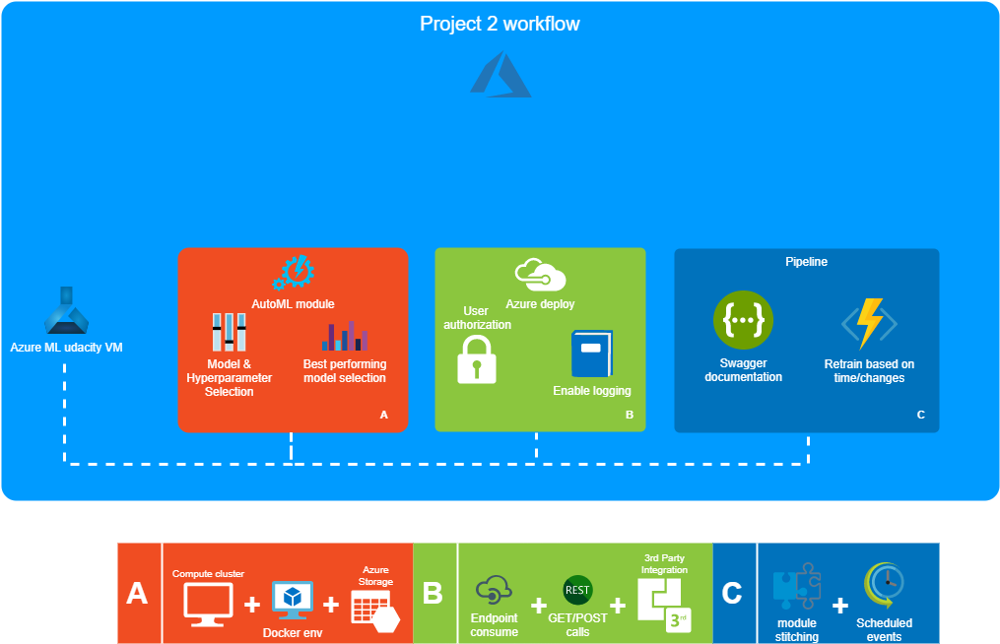
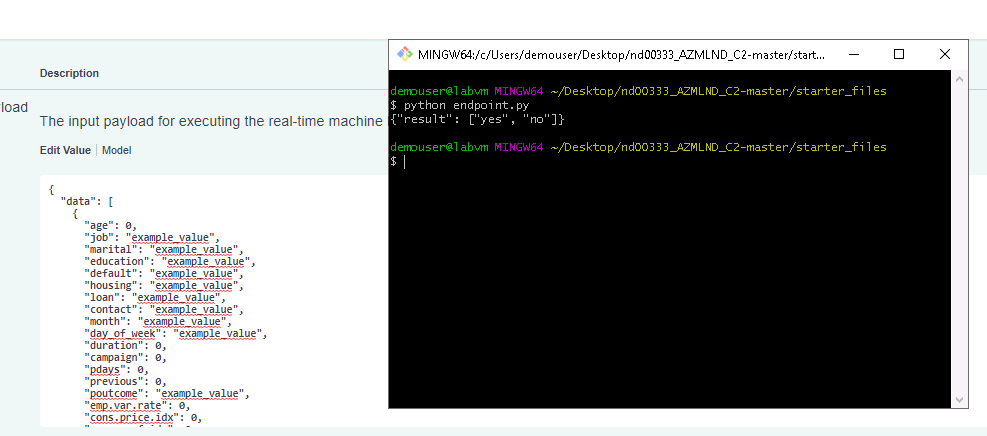

*NOTE:* This file is a template that you can use to create the README for your project. The *TODO* comments below will highlight the information you should be sure to include.

# Creating, deploying, consuming and pipelining an automl model from azureML

Using all the tools offered with azure ML so far the objective for this project is create, deploy and consume an auto machine learning classification project for the data banking dataset

## Architectural Diagram

Using automated ML to explore best model and hyperparameters: Instead of permuting different model options with their respective selection of hyper parameters we let an automated machine learning service to do the heavy lifting for us. This process uses successfull techniques used in order to explore the different models and hyperparameter space to select the best performing combination according to one given metric to optimize.

Deploying the best performing model found as a service: Once the best model is found sometimes is not enough. The main reason to do such exploration is to to use its predictions as a service. To achieve this we deploy the best performing model creating an endpoint. From there the model can be accessed through an API RESTful service (Asuming that user has the required credentials to call such service).

Enabling deploy logging: after deploying our model it is time to enable logging capability to generate text registries of performance for monitoring and comparison.

Creating swagger documentation: Using the built-in swagger documentation tool helps to speed up the adoption of deployed models through API services HTTP requests specifying the input arguments that de model accepts.

Creating a pipeline from a deployed model: ML pipelines stitches together different phases of ML. And it's mainly used to monitor performance in the real world, logging metrics and models outputs and also helps for detecting data drift and give the opportunity to reuse computed modules if changes weren't done.

## Key Steps
*TODO*: Write a short discription of the key steps. Remeber to include all the screenshots required to demonstrate key steps. 

In this section it is listed the steps followed in order to finish this project. There is a screenshot attached to each required step (Some screenshots were taken in two different sessions so there might be some difference in instances naming).

The first step is to upload the banking dataset which we are going to use to fit our model:

Next, employing an automl instance from azureML we are going to let it find the best model/hyperparameter combination that best works optimizing the selected classification metric (AUC weighted):

The process is going to take some while but once it's done you'll be left with a completed automl project with several different models and preprocessing techniques. We select the best performing model to deploy and use its predictions for future queries:

When you deploy a fitted model in a real environment it's possible that your model stumbles with some anomaly that you didn't forsee. In that case it is wise to prepare a series of pre-built modules offered by azureML to log any exception, error or just registered metrics that your deployment outputs:

The following screenshot is an example obtained by this tool:

Another thing that is neccessary when wonking on a project formed by more colleages is a intuitive way to interact with the deploy model for tests or just for compare with another probably better model. Fot that kind of scenarios we can use swagger to automatically generate the expected inputs and format that our model expects them:

Once the model is deployed we can opt for create it with some authorization credentials, this way, we can have more control over who's going to use this service. It is also useful when we are calling another 3rd application to work with the azure ML framework. The following image shows a POST request made by a python script using the provided score URI and authentification key:

Sometimes we also want to measure the time required to our system to respond to certain amount of queries. For this purpose azure CLI has a benchmark command (ab) to run some payload n times and return some basic statistics about the time it took to respond them:

Pipelines are useful parts for a CD/CI paradigm. They can be  sticked together to form a more complex and parallel workflow in a team project. They can also be retrained or re-run whenever certain amount of time is given or some changes to the scripts or databases are detected:

Entire pipelines can be deployed in matter of minutes wraping a lot of overhead for the machine learning/data science teams, leaving more time for experimentations:

The following image depicts the diagram in azure ML of the dataset given to the autoML module along with the published pipeline overview showing such pipeline active and ready to receive request:

This experiment can also be done using de SDK:

So at last of this project we end up with a scheduled pipeline with a model trained on the bankmarketing dataset, ready to classify any new observations that we give to it using the requested JSON payload:

## Screen Recording
[Screencast to project](https://youtu.be/IrqmbhqXVtE)

## Standout Suggestions
*TODO (Optional):* This is where you can provide information about any standout suggestions that you have attempted.
